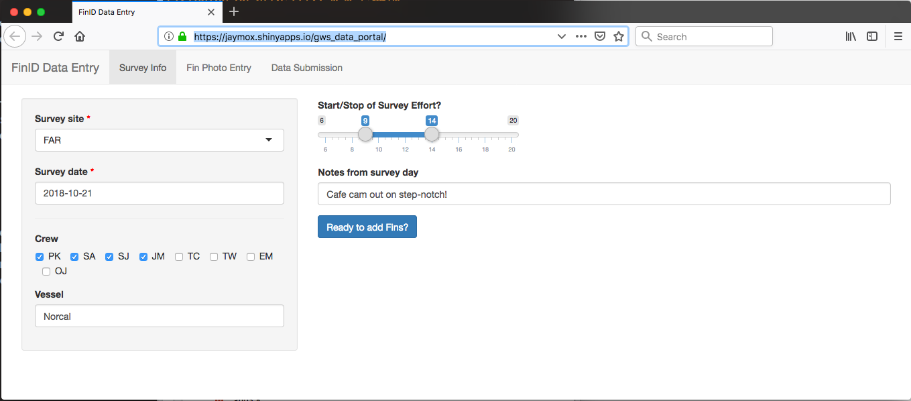
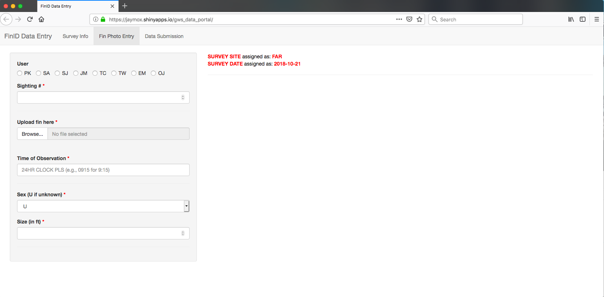
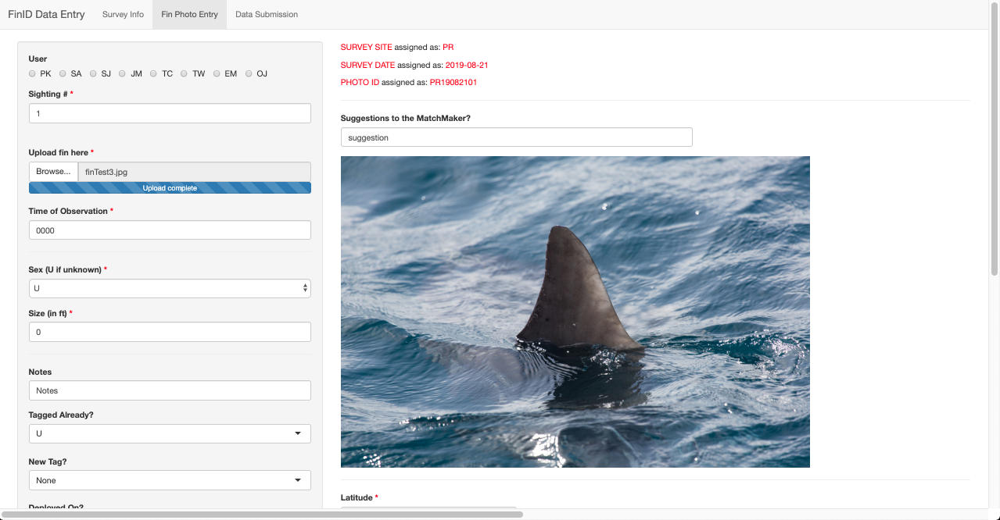
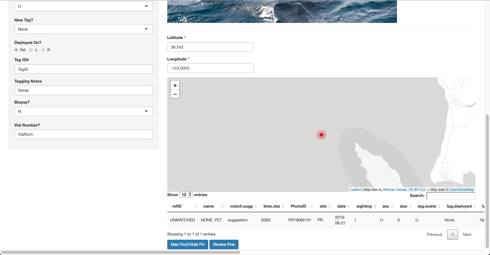
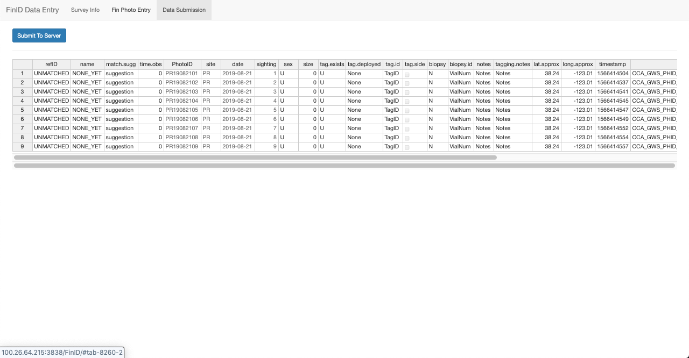
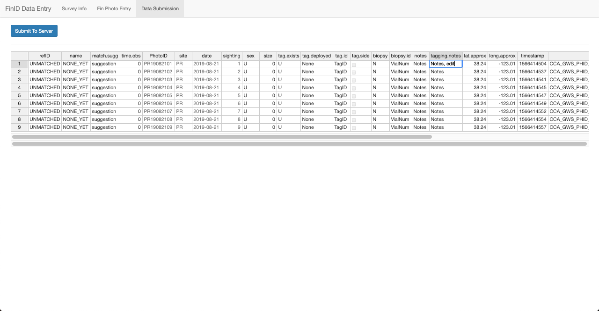
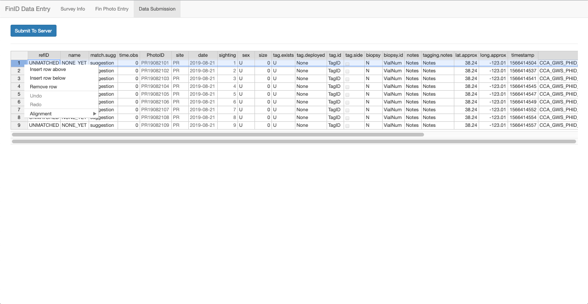

# GWS FinID Portal
### Jerry Moxley, 2018-19

This repository includes the software development of a shiny-based data entry portal for cataloguing FinID photos for MBA white shark research.  The goal is to standardize the collection and stewardship of fin photos and associated metadata collected on shark surveys in central California.  In order to submit new sightings, a data record MUST contain a fin photo as well as survey location, date, sighting number, and (optionally) sex and size.  At the core of the standardization is distinguishing photoIDs from reference IDs.  A photoID (*phid* in code) is a fin observation collected from a photo or video that records an isolated, individual shark sighting.  The reference ID (*refID* in the code) is a curated list that encapsulates only the best photo of each individually-recognized shark and used in matching photoIDs to an individual's longitudinal record.  

## Features & structure
App development focused on a three panel workflow to streamline entry of survey data, sighting observations, and database submission.  At its core, the app is built similarly to [shiny forms repo](https://github.com/daattali/shinyforms).  To support the white shark program, additional features were tailored to the program's research needs and implemented within the app, including:

* standardization & cross-referencing of photoID labels for consistent formating and avoid duplicates/errors;
* set of mandatory fields necessary for entering data;
* dynamic leaflet map for click-friendly estimation of sighting's GPS location, with associated latitude and longitude input boxes;
* auto-populating tables for quick visual checks of data entry;
* data review stage that auto-populates a review table based on the survey's date, location, and the data previously staged with that metadata. This review table is editable and will finalize the data that will be saved to the AWS server 

## Survey Info
The app starts by collecting data on the survey's location, date, crew, vessel, effort, and any notes or observations from that day. Since this info is central to the organizing observations and autopopulates photoID fields for sightings, data entry should focus on entering surveys individually.  Any data pertaining to the entire survey should be entered in this panel

In the below example, I am entering data for a SEFI survey on 2018 October 21, noted that day's Cafe Cam deployment, and am ready to click the button for fin entry.  NOTE: the red stars indicating mandatory fields of location & date that must be populated to create a photoID.  

## Fin Photo Entry
Individual fin photos and shark sighting data are entered in the "Fin Photo Entry" panel, which begins rather blank until adequate data is entered to submit an observation.  For observations to be admitted to the portal, the user must supply a photo, location/date/sighting number for a unique photoID, and a sex/size estimation (n.b.: unknown can be entered in these fields).  

Note that no buttons ("mas fins/Add fins" or "ready to submit") appear until the fin photo and essential photoID data are supplied.  Also note the red astericks indicating a all mandatory fields for observations. The list of mandatory fields can be managed within the function library.  

When enough data is supplied to create a unique photoID, the uploaded photo is rendered on screen and additional fields become availabe for entry.  The user can now append additional data including: existing or newly deployed tags, notes about the observation or possible match, & lat/lon estimated from a clickable map.  For quick visual checks, the table at the bottom of the page auto-populates with the fields as they appear in database entries.  Note the buttons for storing and staging this data for submission are now available.  

The remaining data can be entered once a photo & unique photoID are created.  In the left column, users can provide notes, any tags detected or observed on the animal, and if any new tags were deployed on the animal.  In the case of new deployments, additional data is requested for the side deployed on, tagID number, notes about the tag's programming/package set up, and if a biopsy was taken and stored in a vial.  In the center, the leaflet map estimates lat/lon based on the user's click where the shark was sighted along with input boxes right above the map. The GPS locatoin can be updated using the input boxes and/or through map clicking.  At the bottom is a quickly referenced table to visually check how the data will appear w/in the database. 

## Data Submission
The final panel allows the user to ensure data accuracy and completeness before submitting the observations to the database. There will be an editable table allowing the user to fix any errors except for any columns associated with the Photo ID. These read-only columns include 'PhotoID', 'site', 'sightings', and 'date'. If one of these are incorrect the user can simply delete the row by LEFT-Clicking on the highlighted row and select 'Delete Row', the user can then go back to Fin ID Entry and re-input the fin before submitting to the server. Once the user submits to the server they will be taken to begining in which they can begin a new survey sit entry. **PLEASE SEE SOFTWARE NEEDS**.

 
 

 

This stage will require additional development to support the full needs of database integration. Database integration must be supported for migrating data from staged areas into the formal database.  Finally, this panel can also be used to support matching processes with Zagami and Machine Learning techniques.  

### Software Needs and Dependencies
The app was developed iteratively to maintain full functionality (at one stage) and develop new features (in the next version).  App5.R and App6.R are nearly interchangeable.  App6 began development of update messages & naming conflicts, but is otherwise functionally equivalent to app5.R. Further development was started in the new folder 'FinID', this is the newest version and the one currently being used. In this folder you will find the the ui.R and server.R scripts for the shiny app as well as the support script fin_shiny_fxns2.R.

The app critically depends both on two resources.  First, a function library is stored inside the top-level directory for support in the shiny processing, directory pathways and database management, and metadata standards (e.g., site codes/locs, users, mandatory fields, etc.)  

### Software Bugs as of August 2019
As of August 2019, there are three main isses that need to be resolved. First, when the user inputs a fin into the site and clicks on 'mas fins?/add fin' the site will keep the previous photo uploaded on the screen. Simply upload the new photo and the photo will change. Secondly, when the user uploads the final table to the server by clicking on 'Submit to Server', the user will be taken to the first tab to start over, however not all fields will reset leaving the previous information still there. The user can simply reload the entire site by refreshing the page and everything will be reset. Lastly, edits made to the final table for submission will only be saved if no more fins are added after the edits. Everytime you add a new fin the final table in the Data submissions tab will grab the original data.frame in the backend and will not keep the edits the user has made. I have put a warning on the data submissions page about this issue to simply do any edits at the very end after all fins have been added to ensure all edits are saved.

Summary of bugs:
* Fin Photo in 'Fin Photo Entry' tab does not reset until new photo is uploaded. (Ignore the previous picture and simply upload a new fin photo or click Review Fins)
* After submitting to the server, shiny app is not fully reset (Simply refresh the shiny app in the browser to fully reset)
* Edits to the final table  in 'Data Submission' tab for server submitting will only be saved if no more fins are added (Save all edits till all fins have been added)

### File Locations
The shiny app is saving all csv files on ther AWS server for the Monterey Bay Aquarium in the following directory: /home/ubuntu/Dropbox/

Additionally, the app is saving all photos in the neighboring folder at: /home/ubuntu/Dropbox

### Session info
Here is the sessionInfo when running the app. 

> sessionInfo()
R version 3.5.1 (2018-07-02)
Platform: x86_64-apple-darwin15.6.0 (64-bit)
Running under: macOS Sierra 10.12.6

Matrix products: default
BLAS: /System/Library/Frameworks/Accelerate.framework/Versions/A/Frameworks/vecLib.framework/Versions/A/libBLAS.dylib
LAPACK: /Library/Frameworks/R.framework/Versions/3.5/Resources/lib/libRlapack.dylib

locale:
[1] en_US.UTF-8/en_US.UTF-8/en_US.UTF-8/C/en_US.UTF-8/en_US.UTF-8

attached base packages:
[1] stats     graphics  grDevices utils    
[5] datasets  methods   base     

other attached packages:
 [1] bindrcpp_0.2.2       forcats_0.3.0       
 [3] stringr_1.3.1        dplyr_0.7.7         
 [5] purrr_0.2.5          readr_1.1.1         
 [7] tidyr_0.8.1          tibble_1.4.2        
 [9] ggplot2_3.1.0        tidyverse_1.2.1     
[11] leaflet.extras_1.0.0 leaflet_2.0.2       
[13] shinyjs_1.0          shinyTime_0.2.1     
[15] DT_0.4               rsconnect_0.8.9     
[17] shiny_1.1.0.9001     rdrop2_0.8.1.9999   

loaded via a namespace (and not attached):
 [1] nlme_3.1-137              
 [2] bitops_1.0-6              
 [3] lubridate_1.7.4           
 [4] assertive.models_0.0-1    
 [5] httr_1.4.0                
 [6] rprojroot_1.3-2           
 [7] backports_1.1.2           
 [8] assertive.datetimes_0.0-2 
 [9] tools_3.5.1               
[10] R6_2.3.0                  
[11] lazyeval_0.2.1            
[12] colorspace_1.3-2          
[13] assertive.data_0.0-1      
[14] withr_2.1.2               
[15] assertive.reflection_0.0-4
[16] tidyselect_0.2.5          
[17] mnormt_1.5-5              
[18] curl_3.3                  
[19] compiler_3.5.1            
[20] cli_1.0.0                 
[21] rvest_0.3.2               
[22] assertive.properties_0.0-4
[23] xml2_1.2.0                
[24] assertive.files_0.0-2     
[25] scales_1.0.0              
[26] psych_1.8.4               
[27] askpass_1.1               
[28] digest_0.6.18             
[29] foreign_0.8-71            
[30] rmarkdown_1.10            
[31] assertive.numbers_0.0-2   
[32] pkgconfig_2.0.2           
[33] htmltools_0.3.6           
[34] htmlwidgets_1.3           
[35] rlang_0.3.1               
[36] readxl_1.1.0              
[37] rstudioapi_0.7            
[38] assertive_0.3-5           
[39] bindr_0.1.1               
[40] jsonlite_1.6              
[41] crosstalk_1.0.0           
[42] RCurl_1.95-4.11           
[43] magrittr_1.5              
[44] Rcpp_1.0.0                
[45] munsell_0.5.0             
[46] stringi_1.2.4             
[47] assertive.base_0.0-7      
[48] yaml_2.2.0                
[49] RJSONIO_1.3-0             
[50] plyr_1.8.4                
[51] grid_3.5.1                
[52] parallel_3.5.1            
[53] promises_1.0.1            
[54] crayon_1.3.4              
[55] lattice_0.20-35           
[56] assertive.code_0.0-1      
[57] haven_1.1.2               
[58] hms_0.4.2                 
[59] knitr_1.20                
[60] pillar_1.3.0              
[61] assertive.sets_0.0-3      
[62] reshape2_1.4.3            
[63] codetools_0.2-15          
[64] glue_1.3.0                
[65] evaluate_0.11             
[66] modelr_0.1.2              
[67] httpuv_1.4.5.1            
[68] cellranger_1.1.0          
[69] gtable_0.2.0              
[70] openssl_1.2.1             
[71] assertive.strings_0.0-3   
[72] assertthat_0.2.0          
[73] mime_0.6                  
[74] xtable_1.8-3              
[75] broom_0.4.4               
[76] assertive.types_0.0-3     
[77] later_0.7.5               
[78] assertive.data.uk_0.0-1   
[79] assertive.matrices_0.0-1  
[80] assertive.data.us_0.0-1   
